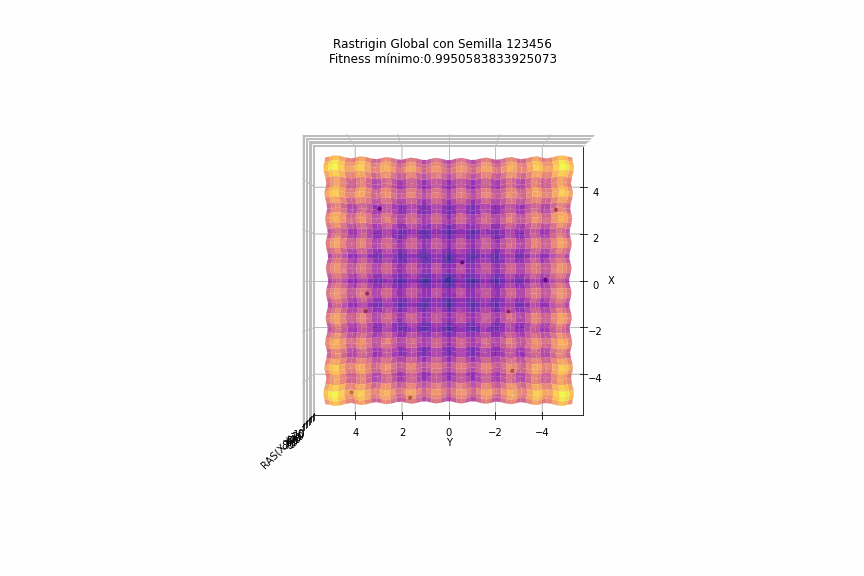
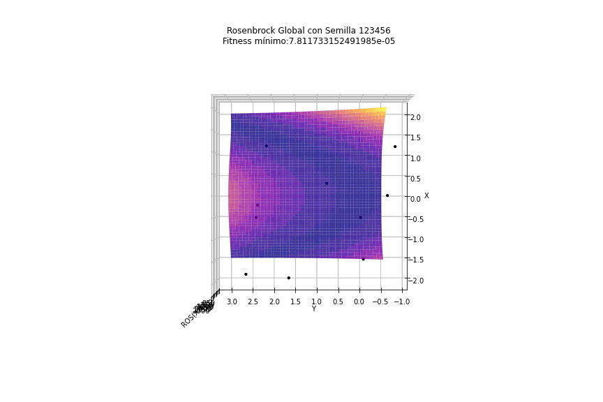
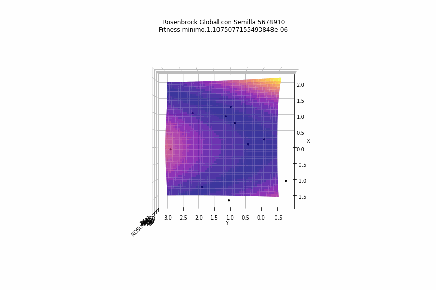
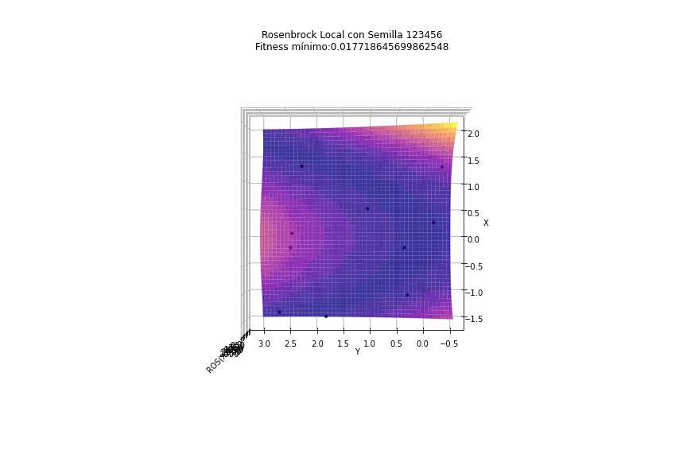

# Optimización de Funciones con PSO: Funciones de Rastrigin y Rosenbrock

Este proyecto implementa el **algoritmo de Optimización por Enjambre de Partículas (PSO)** en sus variantes local y global para encontrar el mínimo de dos funciones de prueba comunes en optimización: la **Función de Rastrigin** y la **Función de Rosenbrock**.

## Descripción del Proyecto

El objetivo de este proyecto es:
- Explorar el comportamiento de PSO en sus variantes local y global.
- Observar el movimiento de las partículas en la búsqueda del mínimo de las funciones de Rastrigin y Rosenbrock.
  
Se incluyen animaciones que ilustran cómo las partículas se mueven en el espacio de búsqueda, intentando converger hacia el mínimo de cada función con diferentes valores de semillas.

## Funciones de Optimización

1. **Función de Rastrigin**: Es una función no convexa utilizada comúnmente para evaluar el rendimiento de algoritmos de optimización en espacios multidimensionales. Presenta muchos mínimos locales, lo que representa un reto para PSO.
2. **Función de Rosenbrock**: También conocida como "valle de Rosenbrock" o "banana function", es una función de prueba común para algoritmos de optimización, caracterizada por un único mínimo global en un valle angosto.

## Animaciones de las Simulaciones

A continuación se muestran las animaciones del movimiento de las partículas en el espacio de búsqueda para cada función y configuración de PSO. Cada conjunto de animaciones utiliza una semilla diferente para observar el impacto en el comportamiento de las partículas.

### Función de Rastrigin - PSO Global



### Función de Rosenbrock - PSO Global





### Función de Rastrigin - PSO Local


### Función de Rosenbrock - PSO Local



## Requisitos

- **Python 3** y las siguientes bibliotecas:
  - `numpy`
  - `matplotlib`

## Ejecución del Proyecto

Para ejecutar las simulaciones, simplemente ejecuta el script de Python principal, que generará animaciones de la evolución de las partículas en el espacio de búsqueda para ambas funciones y configuraciones de PSO.

```bash
python nombre_del_script.py
